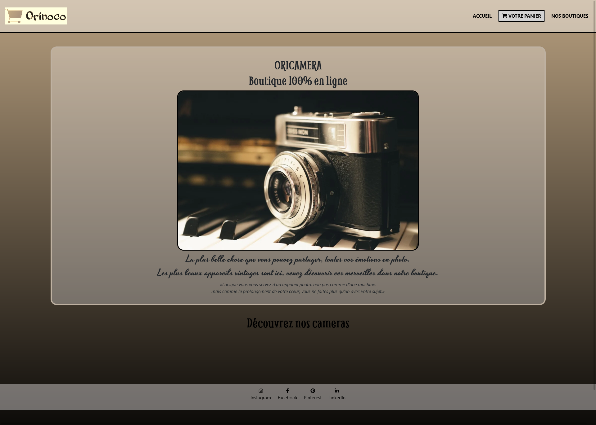
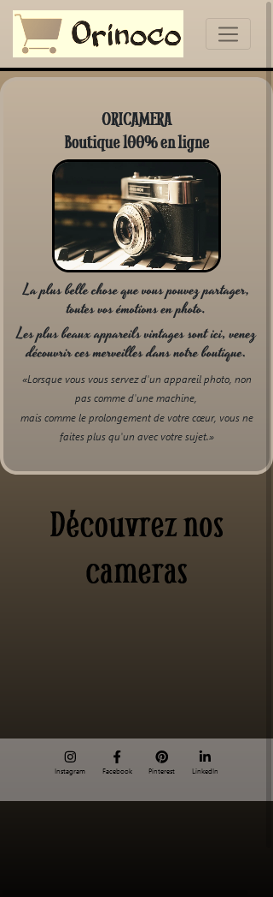
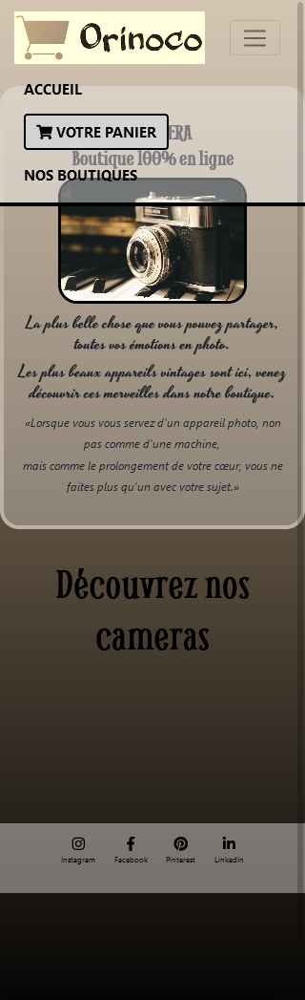

<h1 align="center" style="border-bottom: none !important; margin-bottom: 5px !important; text-decoration: none; font-size: 34px; color: #a89274;">
    Bienvenue sur le Projet 5 - Orinoco du parcours développeur web d'OpenClassrooms
</h1>
<h2 align="center" style="border-bottom: none !important; margin-bottom: 5px !important; text-decoration: none; font-size: 34px; color: #a89274;">
    Oricamera
</h2>

    

    
Il s'agit du serveur Front-End pour le projet 5 du parcours Développeur Web.

    <h2> Pré requis </h2>
    
Vous devez avoir Node et npm installés localement sur votre machine.

    
Pour cela clonez le dépot https://github.com/OpenClassrooms-Student-Center/JWDP5.git qui est la partie Back-End.

    
Depuis le dossier du projet, exécutez npm install

    
Vous pouvez ensuite exécuter le serveur avec node server.

    <h2> Installation </h2>
    
Clonez ce dépôt. 

    
Le serveur doit fonctionner sur localhost avec le port 3000 par défaut.

    
Si, pour une raison quelconque, le serveur fonctionne sur un autre port,

    
celui-ci est affiché dans la console au démarrage du serveur, par exemple : Listening on port 3001.

    
Double cliquez sur index.html pour afficher le site ou simplement cliquez sur le lien en haut à droite dans la section "About".

    
    

    
    
    

    
 

    <h3> Liste des pages</h3>
    <ul style="list-style: none;"">
        <li> - Index / Accueil </li>
        <li> - Index / Accueil version mobile </li> 
        <li>- Catalogue </li>
        <li>- Catalogue version mobile </li>
        <li>- Panier / Formulaire / Confirmation </li>
        <li>- Panier / Formulaire / Confirmation version mobile </li>
        <li>- Nos boutiques (Oribears / Oriwoods) page error </li>
        <li>- Nos boutiques (Oribears / Oriwoods) page errorNos boutiques (Oribears / Oriwoods) page error version mobile </li>
    </ul> 

 

    <h3> Built using</h3>
    <ul>
        <li style="list-style: none;">- HTML</li>
        <li style="list-style: none;">- CSS</li>
        <li style="list-style: none;">- BOOTSTRAP</li>
        <li style="list-style: none;">- JavaScript</li>
        <li style="list-style: none;">- Fontawesome</li>
    </ul>

